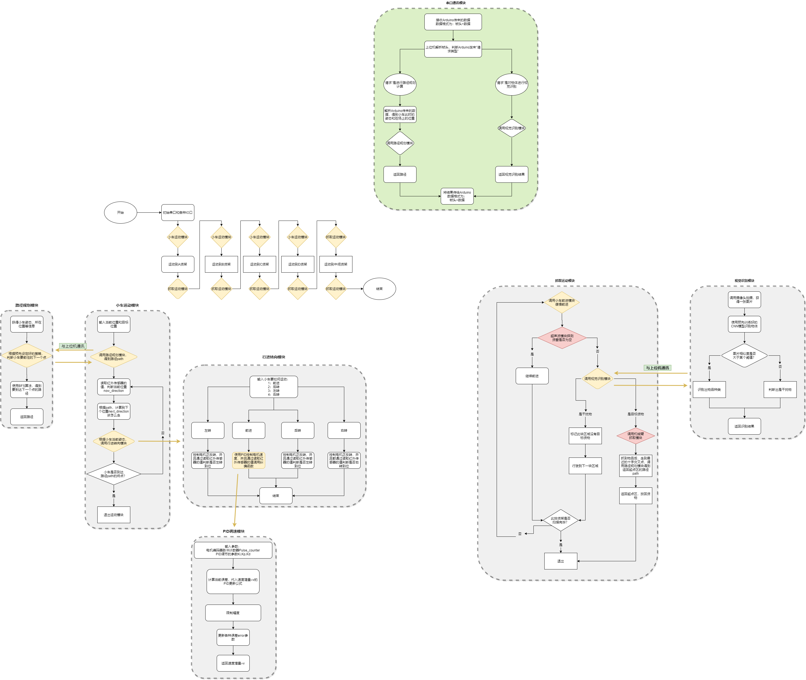
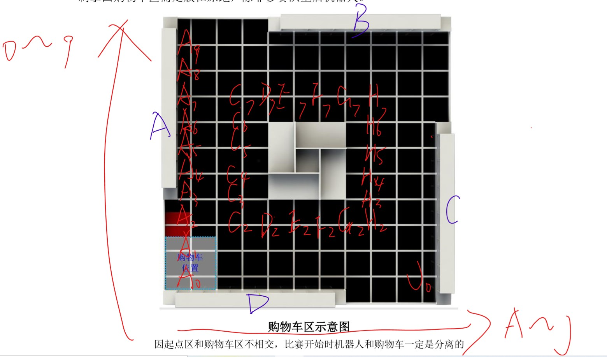
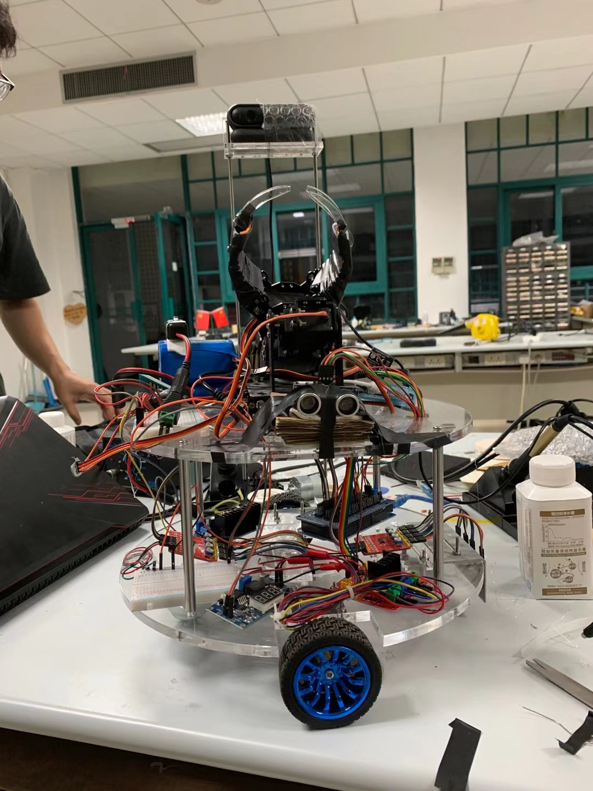

# ZJU 16th "中控杯"机器人竞赛

**自主取货机器人基础操作。包含行进、识别、路径规划、抓取及上下位机通讯等功能。**

- **项目地址：** [https://github.com/MarioLulab/zkcup](https://github.com/MarioLulab/zkcup)

- **项目作者：** Lu Qi http://www.mariolu.top

## 项目文件夹说明

- * main文件夹 -> Arduino(下位机)代码，包含最终调试好的行进，转向，抓取以及上下位机通讯等功能
  * onRaspberry文件夹 -> Raspberry pi 3b+(上位机)代码。实现**上下位机通讯、路径规划和视觉识别**
    * Ser_coummunication.py -> 树莓派运行主程序。上位机的代码可以从这个文件看起
    * BFS_plan.py -> **路径规划模块**。使用邻接链表管理图，BFS算法来计算最短路径
    * 该文件夹下剩余python文件及文件夹均为 -> **视觉识别模块**
  * test文件夹 -> Arduino(下位机)代码模块调试程序。包含行进电机控制、机械爪控制和超声波数据显示
    * test_servo -> 机械爪串口调试程序
    * test_motor -> 行进电机调试程序
    * test_ULscan -> 超声波模块调试程序

## 机器人控制策略流程图

​		这是一审时提交的设计方案，后续大致如此，只是有少许精简和改进。仅供参考

​		比如：PID调速换成了用定时器控制的斜坡调速，效果也不错

## 下位机代码说明

* **main文件夹中的main.ino是整个下位机的代码**

  > 比较遗憾的是，当时没有搞懂怎么多文件组织Arduino工程代码(现在看来很简单，只是当时忘记添加相关的编译建议了)，自己当初写多文件的时候总是出现重复定义。想要学习和使用多文件组织Arduino项目代码的同学可以参考14th中控杯刘承相学长那一组的代码。

  本项目的单文件代码组织如下：

  \----------------------------------------

  各模块关键常量宏定义

  各模块关键变量定义与初始化

  各模块函数声明

  \----------------------------------------

  抓取运动模块函数实现

  \----------------------------------------

  下位机通讯模块函数实现

  \----------------------------------------

  运动模块函数实现

  \----------------------------------------

  路径规划模块函数实现

  \----------------------------------------

  识别模块函数实现

  \----------------------------------------

  货窗扫描主函数ShelfCatch_LOOP()

  \----------------------------------------

  arduino setup()函数

  \----------------------------------------

  arduino loop()函数

  \----------------------------------------

* **下位机代码食用顺序建议**

  1. 先从loop()函数看起。Master_OK全局变量在上位机传达开始命令后改变为1，进入ShelfCatch_LOOP()主循环
  2. 再从ShelfCatch_LOOP()函数看起，一步步向底层控制看去

## 上位机代码说明

* **onRaspberry文件夹中的main.ino是整个下位机的代码**

* **上下位机通讯模块** -> Ser_communication.py。没啥好说，上位机代码应从这个文件开始看，再看其中是如何组织其上下位机通讯、视觉识别模块和路径规划模块的

* **路径规划模块** -> BFS_plan.py。文如其名，核心是使用BFS进行最短路径规划，图用邻接链表存储。写这个模块前，我先对比赛场地建立了一个坐标系

  

  **需要注意的是**：在A3,A2,A1,A0附近的点我有所改动。这是因为起点区是红色的，而我们的红外循迹传感器不能分辨黑色和红色，所以要尽量避免小车从B2->A2。

* **视觉识别模块** -> onRaspberry文件夹下的其他文件。

  * **识别流程**：先用**MobileNet**目标检测器框出目标物，然后用迁移学习好的**ResNet18**对目标物进行分类
  * /models/文件夹下存放着已经训练好的模型参数。CNN我是在自己的PC机上训练的，MobileNet我是在Google Colab平台上使用GPU训练的

## 本届中控杯遗憾的地方

> 一些碎碎念...

* 电机速度太慢了... 4秒才走完一格
* 调机械臂花费了太多时间...基本最后一个月都在调试机械臂抓取
* CNN的识别准确率还没有达到最佳。最后比赛的时候把一个干扰物绿方块识别成了目标物蓝方块，加上电机速度又慢，这会浪费不少比赛时间

## 参赛建议

1. **下位机控制**。可以多阅读往届的参赛代码，比赛时巡线一定要稳，我们是使用前面四个红外巡线传感器用来循迹，正中间四个红外巡线传感器用来判断是否到点。
2. **视觉识别**。刚入门深度学习的同学可以先看看[深度学习电子书](http://neuralnetworksanddeeplearning.com/)，至少把前两章看完，理解Back Propagation的原理。看看[B站pytorch教程](https://www.bilibili.com/video/BV12741177Cu?from=search&seid=3050657063860714723)，这个系列的教程是基于Pytorch的，可以做里面的项目进行实战练练手。再推荐一个csdn的博主[Bubbliiiing](https://blog.csdn.net/weixin_44791964)，想使用高级一点的神经网络可以参考他的博文，博文里的源码以及说明都很详细。如果想要更深入学习的AI的话，还是建议学习国外大学的网课，这样更系统一些，在此就不再赘述了。
3. **心理准备**。由于中控杯比赛很长，所以队友一定要靠谱，并且要做好打持久战的准备。只要坚持下来成绩不会差的。

## 感谢

在此要感谢两位队友——hxy(https://github.com/hhubibi/) 和 xpy 的倾力协助，他们的付出为本项目的完成提供了很大的帮助。

还要感谢赛事的主办方（浙江大学机器人实验室），感谢他们为这场周期很长的比赛保驾护航。

最后，感谢它！！！！

